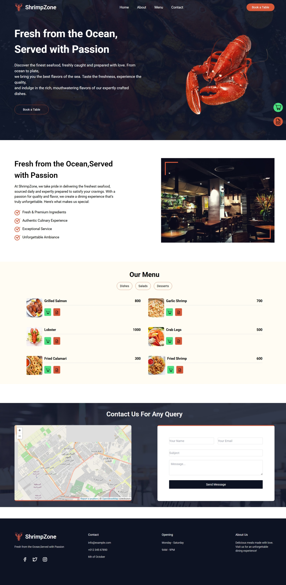

# Restaurant Website 
This is a responsive restaurant website built with HTML, JavaScript, and Tailwind CSS. It features a menu system, a shopping cart, and a wishlist for saving favorite items..
## 🔗Live Demo
https://tokaashraf1.github.io/Restaurant-website/
 
 
 ## 🚀 Website Preview
 
 

 
 

    

